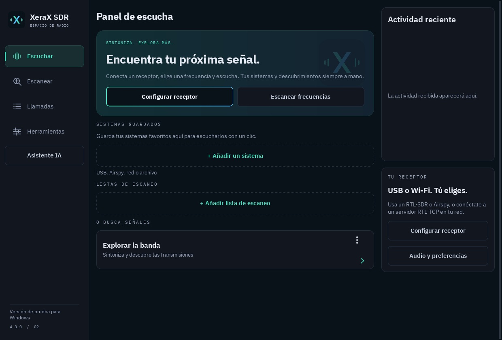

# XeraX SDR

**Receptor SDR, decodificador de voz digital y escáner para Android, con controles en español e inglés.**

## 4.3.2-rc.2 — detección anticipada de NXDN48 opcional

[Versión de prueba RC2](https://github.com/ElXavi07/XeraX-SDR/releases/tag/v4.3.2-rc.2) · [Notas y límites](releases/4.3.2-rc.2/NOTES.md). Incluye paquetes para Android **arm64-v8a / armeabi-v7a** y Windows **x64 con instalador / ZIP portátil**.

Abre **Herramientas** para llegar a Ajustes y busca **Decodificación · próximo inicio → Detección más rápida de NXDN48 (experimental)**. Durante la escucha, abre **Session options → Ajustes**. Está **desactivada por defecto** y los cambios se aplican al detener e iniciar otra vez la escucha. Prueba la primera sincronización canónica de polaridad positiva de una señal NXDN48 y conserva la validación de tramas y CRC. El reprocesamiento de I/Q y el laboratorio integrado usan sus propios ajustes.

El [experimento sintético previo del componente](docs/research/NXDN-FIRST-SYNC-2026-09-25.md) obtuvo la primera trama de control válida unos **80 ms antes en 120 casos positivos**, sin validaciones falsas de la trama actual en **36 controles**. Esto no demuestra audio más rápido, menor uso de CPU ni mejor recepción en dispositivos. Faltan pruebas físicas con teléfonos, receptores y escucha humana. Las versiones anteriores siguen disponibles abajo.

**Versión preliminar para Windows:** [instalador y ZIP portátil](https://github.com/ElXavi07/XeraX-SDR/releases/tag/v4.3.1) · [instrucciones y límites](docs/WINDOWS.md). Aplicación nativa para Windows 10/11 de 64 bits, con recepción, decodificación, escaneo y audio de escritorio. Algunas funciones de Android descritas abajo aún no están disponibles en Windows.

**Nueva interfaz de escritorio:** navegación lateral, icono de Windows, acceso directo al escáner, barras de desplazamiento e investigaciones opcionales con OpenAI / DeepSeek. [Capturas de pantalla](docs/WINDOWS-SCREENSHOTS.md) · [Validación actual](docs/RECEIVER-QUALITY-4.3.1.md)

[Descargar 4.3.1](https://github.com/ElXavi07/XeraX-SDR/releases/tag/v4.3.1) · [English](README.md) · [Funciones completas, en inglés](docs/FEATURES.md) · [Informar un problema](https://github.com/ElXavi07/XeraX-SDR/issues)

**4.3.1 es una versión de pruebas para la comunidad.** Mejora la eficiencia de un cálculo del decodificador, distingue las etapas de recepción/audio y permite guardar un informe local sin claves ni credenciales. [Mediciones y límites](docs/RECEIVER-QUALITY-4.3.1.md). Faltan pruebas completas con teléfonos y radios físicos.

## Instalación

Necesitas **Android 10 o posterior** y un SDR compatible por USB OTG o una fuente de red compatible. El teléfono por sí solo no recibe estas señales.

- **[ARM64](https://github.com/ElXavi07/XeraX-SDR/releases/download/v4.3.1/XeraX-SDR-4.3.1-arm64.apk):** Galaxy S25, Pixel 9 Pro y otros Android ARM de 64 bits.
- **[ARMv7](https://github.com/ElXavi07/XeraX-SDR/releases/download/v4.3.1/XeraX-SDR-4.3.1-armeabi-v7a.apk):** Android ARM de 32 bits; también requiere Android 10+.
- **[Código fuente](https://github.com/ElXavi07/XeraX-SDR/releases/download/v4.3.1/XeraX-SDR-4.3.1-source.zip).** La publicación incluye sumas SHA-256 y verificación.

Instala como actualización sobre una versión oficial anterior para conservar los datos. En **Settings → Language / Idioma** puedes cambiar el idioma sin reiniciar la recepción. Hay 981 traducciones verificadas; algunos textos técnicos heredados y nombres de bases de datos mantienen su idioma original.

## Funciones

| Área | Qué incluye |
|---|---|
| Radio analógica | FM estrecha, AM y FM comercial mono |
| Voz digital | NXDN48/96; DMR Tier II y opción de una ranura; P25 Fase 1/2, C4FM/CQPSK y simulcast |
| Otros modos | D-STAR, YSF, M17 con Codec2, dPMR, X2-TDMA, ProVoice y EDACS configurado |
| Escaneo por rango | 440–450 / 440–460 MHz y rangos propios; pasos y velocidades; retener, saltar, evitar y guardar frecuencias |
| Listas y sistemas | Canales analógicos/digitales, prioridades, talkgroups, mapas, alias y seguimiento de sistemas compatibles |
| Espectro | Cascada, picos, ajuste fino deslizando, pasos, zoom, ganancia y PPM automático/manual |
| Audio | Altavoz interno u otra salida, tonos de prueba, diagnóstico real y repetición de los últimos 30/60 segundos |
| Grabaciones | WAV por llamada, actividad analógica, búsqueda, favoritos, retención y exportación |
| Señalización | CTCSS/DCS, MDC-1200, FleetSync, DTMF y secuencias de dos tonos |
| Herramientas | Diagnóstico USB, mediciones, ensayos acotados de ganancia/sitio, filtros, hallazgos y perfiles |
| Laboratorio I/Q | Captura local, repetición/comparación y ecualizador de simulcast experimental |
| Varios canales | DMR de cuatro frecuencias dentro de una captura RTL, selección de audio y P25 con dos dongles; experimental |
| Datos y ubicación | Sitios guardados cercanos, estudio de actividad de banda, importación RadioReference y copias de configuración |
| IA opcional | OpenAI/DeepSeek con tu clave, modelos obtenidos de la API y herramientas locales de medición/comparación |

La IA está desactivada inicialmente. Audio e I/Q permanecen en el teléfono; tu pregunta y datos numéricos filtrados se envían al proveedor. La inferencia usa internet. El escáner y los decodificadores no necesitan IA.

## Radios y límites

Se incluyen controladores para RTL-SDR Blog V3/V4/V4 Lite y RTL compatibles, Airspy R2/Mini y **HackRF One experimental, solo recepción**, con límite actual de la aplicación de aproximadamente 2 GHz. RTL-TCP permite usar una radio conectada a otra computadora. No hay soporte directo para SDRplay, LimeSDR, Airspy HF+ ni cualquier dispositivo SoapySDR.

Hay perfiles de claves suministradas: DMR Basic Privacy 0–255, NXDN 0–32767, ADP/ARC4 y otros formatos compatibles, incluidos caminos P25 AES/DES. Coincidir un ID de clave no demuestra que la clave sea correcta. RAS de DMR no es cifrado.

Existe una búsqueda **experimental y opcional del scrambler NXDN de 15 bits**, que exige dos coincidencias de patrones antes de aplicar un candidato. No está validada con recepción real codificada ni garantiza encontrar la clave. No es recuperación universal ni ruptura de AES/DES o cualquier cifrado P25.

Un receptor recorre el rango por partes; puede perder llamadas breves. El escáner admite solicitudes de 24–1766 MHz, hasta 50 MHz de ancho y 10 001 posiciones; también se aplican límites del hardware. P25 Fase 2 y trunking requieren configuración real. No se incluyen TETRA, ADS-B, AIS, ACARS, POCSAG/FLEX, SSB ni estéreo/RDS.

## Primera prueba

1. Abre **Explore**, elige receptor, frecuencia conocida y modo correcto.
2. Para voz analógica VHF/UHF elige **Analog FM (NFM)**.
3. Inicia, selecciona el altavoz y sube volumen multimedia. **Check audio → Test sound** comprueba el reproductor sin transmisión.
4. Para buscar, activa **Scan a frequency range** y empieza con **Balanced**.

Un canal de control puede tener actividad sin voz. “Esperando audio” no demuestra por sí solo una falla del altavoz.

## Comunidad

Aceptamos informes y contribuciones en español o inglés. Incluye versión, teléfono, Android, receptor, conexión, modo y pasos. No publiques contraseñas, claves ni exportaciones sin revisar. Consulta [CONTRIBUTING](CONTRIBUTING.md).

Derivado independiente de [DSD-neo](https://github.com/arancormonk/dsd-neo), bajo **GPL-3.0-or-later** y avisos de sus dependencias. [Motor completo](upstream/dsd-neo) · [Compilación](docs/BUILD.md).
