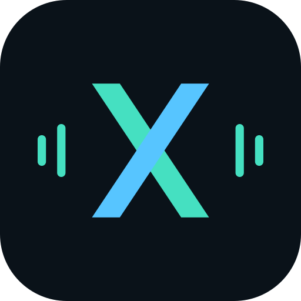

# XeraX SDR

**Android SDR receiver, digital voice decoder and scanner, with English and Spanish controls.**

[Download 4.3.0](https://github.com/ElXavi07/XeraX-SDR/releases/tag/v4.3.0) · [Español](README.es.md) · [Getting started](docs/QUICKSTART.md) · [Complete features](docs/FEATURES.md) · [Issues](https://github.com/ElXavi07/XeraX-SDR/issues)

XeraX combines analog listening, DMR, NXDN and P25 decoding, spectrum tuning, range scanning, recordings, receiver diagnostics and optional AI investigations. Reception and decoding run on the phone using a connected SDR or a supported network source.

**4.3.0 is a community testing release.** Both APKs are built and signed. The release records 33 passing host test groups and 80 passing QML cases. Physical phone/receiver acceptance, live AI-provider calls, weak-signal performance and scan-speed measurements remain pending. See [validation](docs/VALIDATION.md).

## Download

Requires **Android 10+** and a compatible receiver/input. A phone alone cannot receive these SDR signals.

| Package | Use it for |
|---|---|
| [ARM64 APK](https://github.com/ElXavi07/XeraX-SDR/releases/download/v4.3.0/XeraX-SDR-4.3.0-arm64.apk) | Galaxy S25, Pixel 9 Pro and other 64-bit ARM Android runtimes |
| [ARMv7 APK](https://github.com/ElXavi07/XeraX-SDR/releases/download/v4.3.0/XeraX-SDR-4.3.0-armeabi-v7a.apk) | 32-bit ARM Android runtimes; still requires Android 10+ |
| [Matching source](https://github.com/ElXavi07/XeraX-SDR/releases/download/v4.3.0/XeraX-SDR-4.3.0-source.zip) | Complete patched engine, build scripts, tests and original release documentation |

Install the package appropriate to your Android runtime. Existing official XeraX installations can update using the same package/signing identity. Builds signed by someone else may require a separate installation. Release assets include SHA-256 checksums and a verification report.

## Included features

- **Analog and digital:** NFM two-way voice, AM, broadcast FM mono, NXDN48/96, DMR Tier II, P25 Phase 1/2 and additional inherited digital modes in the [protocol matrix](docs/PROTOCOLS.md).
- **Range scanning:** enter a range, including 440–450 / 440–460 MHz presets; choose spacing, mode and speed; Hold, Skip, Avoid, resume and save discoveries.
- **Scan lists and trunking:** mixed analog/digital lists, priority rotation, talkgroups, channel maps, aliases and supported configured trunked systems.
- **Spectrum:** waterfall, peak selection, fine swipe tuning, channel steps, zoom, gain and automatic/manual PPM.
- **Audio:** phone speaker/output selection, test tones, actual PCM diagnostics, replay, call recordings and WAV export.
- **Receiver tools:** USB diagnostics, measurements, bounded gain/site trials, I/Q capture/comparison, experimental nearby receivers and two-dongle P25.
- **RadioReference:** account-based conventional/trunked imports, site selection and nearby browsing. Account entitlements apply; no shared user account is included.
- **Optional AI:** your OpenAI or DeepSeek key, models fetched from the provider and controlled local measurement tools. Disabled by default; model inference uses the provider's internet service.
- **Bilingual interface:** English/Spanish selection and 878 catalog translations checked in this release. Some inherited technical text and database labels retain their original language.

See the [complete feature guide](docs/FEATURES.md) for privacy handling, experimental features and limits, and the [scanner guide](docs/RANGE-SCANNER-4.3.0.md) for operating controls.

## Receivers

| Hardware/source | Included path | Status |
|---|---|---|
| RTL-SDR Blog V3, V4, V4 Lite and supported RTL2832U dongles | Android USB OTG or compatible RTL-TCP | Driver included; tuner limits and USB power apply |
| Airspy R2 / Mini | Android USB OTG, Airspy source | Backend included; hardware acceptance pending |
| HackRF One | Android USB OTG, receive only | Experimental; current app range approximately 1 MHz–2 GHz |
| RTL-TCP | Compatible server on another host | Raw I/Q streamed to the phone; appropriate server driver required |
| Supported file / PCM inputs | Local replay or TCP/UDP audio source | Format and mode must match the engine |

This is an implementation matrix, not certification of every receiver/phone pair. Direct SDRplay, LimeSDR, Airspy HF+ and general SoapySDR support are not included. [Receiver guide](docs/RECEIVERS-4.1.2.md) · [Wi-Fi setup](docs/WIFI-RECEIVER-SETUP.md)

## First session

1. Install the APK and connect a supported USB SDR with an OTG data adapter, or configure RTL-TCP on your local network.
2. Open **Explore**, choose the source, frequency and mode. Use **Analog FM (NFM)** for narrowband analog two-way radio.
3. Grant USB access, start reception, select **Phone speaker** and raise media volume. **Check audio → Test sound** tests playback independently of traffic.
4. For a band search, enable **Scan a frequency range** in Explore. Start with **Balanced** and select the known protocol when possible.

Control/signaling channels can be active without voice. “Waiting for audio” alone does not establish a speaker fault. [Full setup and troubleshooting](docs/QUICKSTART.md)

## Source and community

The complete patched engine is browsable in [upstream/dsd-neo](upstream/dsd-neo). [UPSTREAM.json](UPSTREAM.json) pins its original revision; [patches/xerax.patch](patches/xerax.patch) records XeraX's changes. The release source ZIP is the frozen 4.3.0 packaging snapshot; repository documentation may receive corrections afterward.

[Build on Windows](docs/BUILD.md) · [Contribute and report hardware results](CONTRIBUTING.md) · [Phone acceptance](docs/PHONE-ACCEPTANCE.md) · [Privacy](upstream/dsd-neo/PRIVACY_POLICY.md)

This is an independent derivative of [DSD-neo](https://github.com/arancormonk/dsd-neo), not an official upstream release. Digital implementations and the vocoder come from upstream and its dependencies; XeraX extends the Android interface, receiver controls, analog paths, scanning, imports and diagnostics. No measured superiority over an SDS100 or another decoder is claimed.

Distributed under **GPL-3.0-or-later**, with retained third-party notices. See [LICENSE](LICENSE), [COPYRIGHT](upstream/dsd-neo/COPYRIGHT) and [third-party attribution](upstream/dsd-neo/THIRD_PARTY.md).
