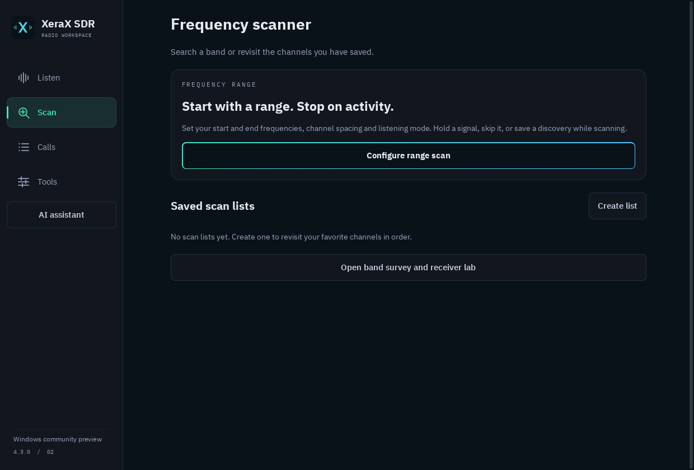
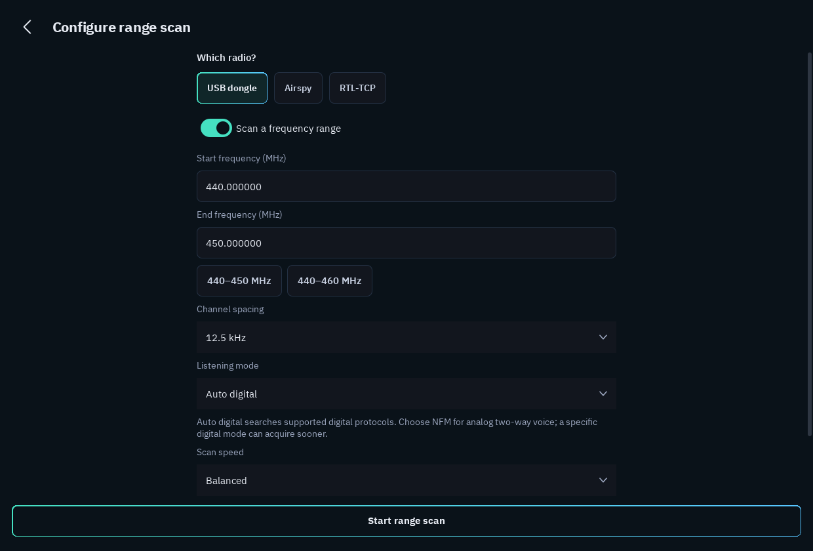
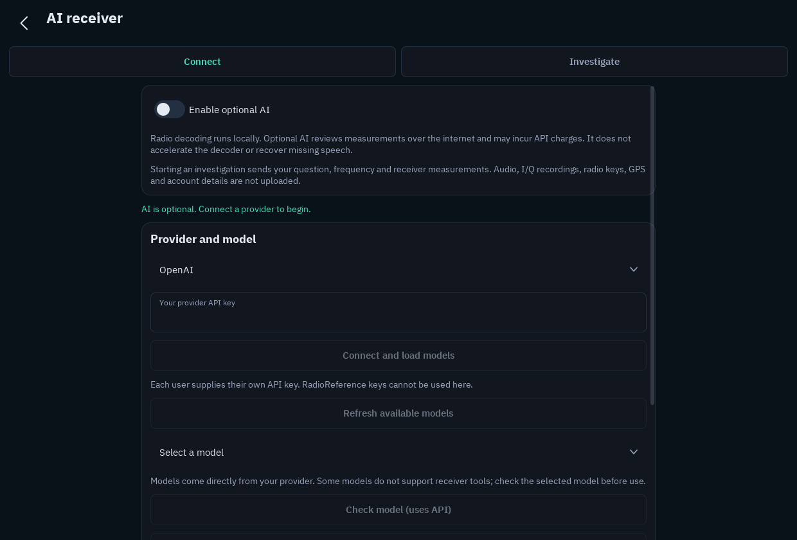
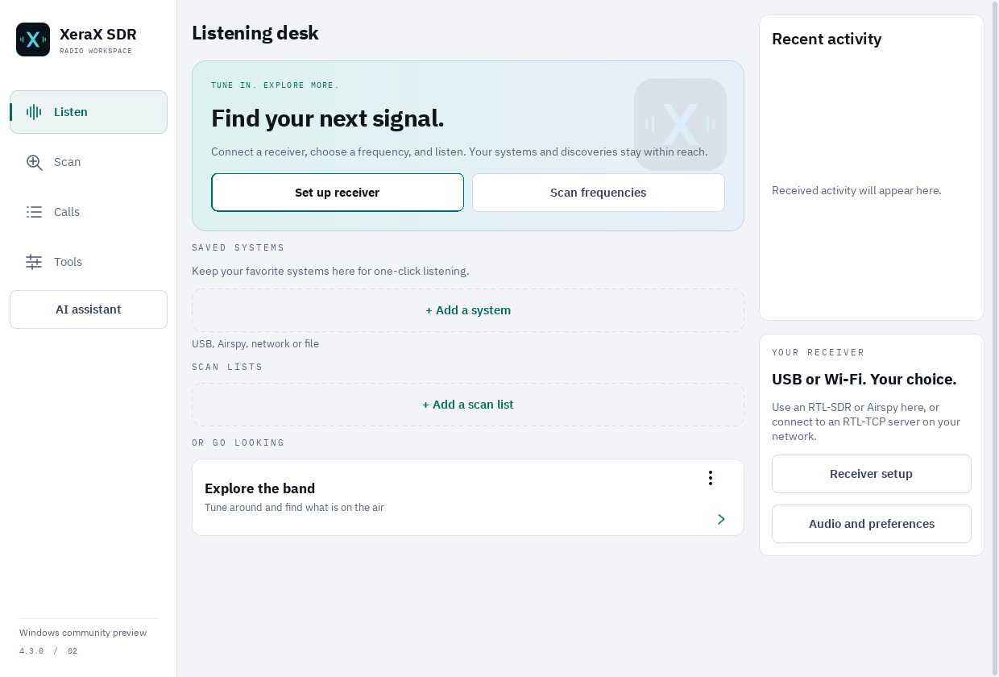

# Windows preview 2 — screenshots / capturas

Actual captures from the Windows application, using its separate test profile.
No radio traffic, conversations or AI results have been fabricated. These views
show setup and empty saved lists; they are not evidence of on-air reception.

## Listening desk · English

Receiver setup and frequency scanning are one click from the home screen.

## Panel de escucha · Español

Navegación, configuración y controles principales en español.

## Frequency scanner

Start a range scan, create a saved list, or open the band survey.

## Range setup

Choose the receiver, endpoints, channel spacing, listening mode and speed.
The rest of the settings are reachable by scrolling.

## Optional AI

AI is off by default. Connect your own OpenAI or DeepSeek key, load models,
and verify tool compatibility. It can investigate receiver measurements and
compare gain; it does not accelerate the decoder. No key is shown in this image.

## Light theme

Choose light, dark or the system appearance in Tools.

[Download Windows preview 2](https://github.com/ElXavi07/XeraX-SDR/releases/tag/v4.3.0-windows.2)
· [Setup and limits](WINDOWS.md)
