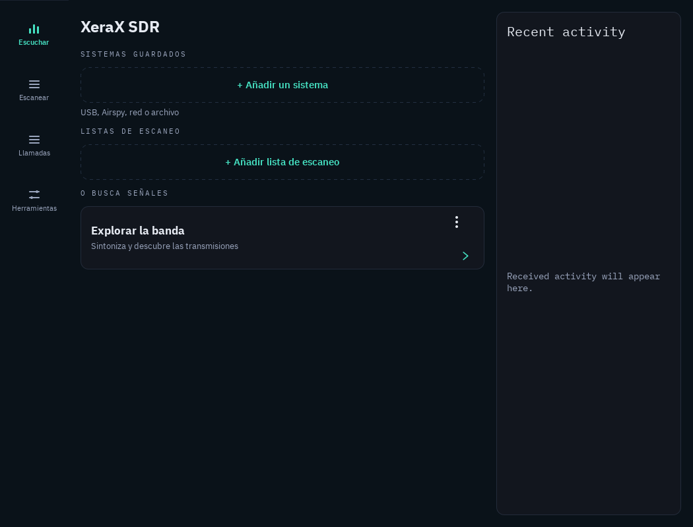

# Windows preview validation — 4.3.0-windows.1

Software checks on the Windows x64 build, 24 September 2026:

| Check | Result |
|---|---|
| Existing host suite, including scanner policy, QML, audio and protocol fixtures | 33 groups passed |
| Full I/Q decoder/scan regressions and atomic P25 voice tuning | 31 passed |
| App-lab fixtures through the Windows engine | 14 baseline cases and one experimental equalizer case passed |
| Four offset/bandwidth comparisons | Completed without crashes; exploratory, without pass thresholds |
| Shipped GUI with a clean runtime search path | 12 checks passed |
| Installer and native Windows launch | Installed successfully; native Windows startup passed; installed/portable files matched the staged application |
| NFM, AM and WFM over synthetic RTL-TCP | Nonzero PCM reached the real PortAudio output |
| Analog tone fidelity via production decoder / UDP PCM | All three modes passed spectral and headroom checks |
| Invalid or stalled RTL-TCP sessions | Four engine cases terminated without forced timeouts; GUI refused/invalid/missing-header cases showed failures |
| Scanner audio gate | Decoding continued while speaker output paused, then resumed; at most one 20 ms write was already in flight |
| Replay and diagnostic tones | Playback started/stopped correctly; test tones were excluded from received-radio counters |
| English/Spanish layout | Welcome screen and desktop home rendered and reviewed; 921 catalog placeholders checked |

The GUI checks use the actual Windows host, decoder and PortAudio backend, not a
mock PCM producer. The generator feeds local test I/Q into the real RTL-TCP
input. The report distinguishes decoded PCM from device-accepted output. Human
listening, speech intelligibility and physical SDR/antenna performance are not
established by these counters.

These results do not certify every radio protocol, receiver or Windows audio
device. USB hardware acceptance, independent community computer testing,
weak-signal comparisons and field scan-speed measurements remain pending.
Android-only features retain their previous test evidence; these Windows checks
do not add Windows support for the omitted features listed in [WINDOWS.md](WINDOWS.md).

The release includes a machine-readable verification report and SHA-256 hashes.
Run `scripts/check_windows.py`, `scripts/check_rtltcp_audio.py` and
`scripts/check_rtltcp_failures.py` against the Windows binaries to repeat the
application and network checks. The `--smoke-seconds` developer mode is explicit,
bounded and uses separate test settings. Normal launches do not run test tones
or tune any source automatically.

