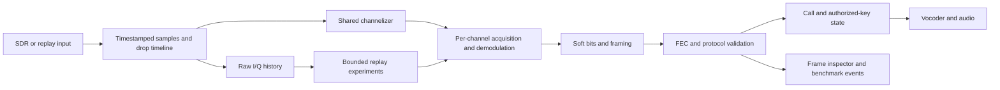

# Measured XeraX SDR engineering program

Baseline: Windows preview 3 at ab79212. Research references: [platform comparison](PLATFORM-COMPARISON-2026.md), [privacy/conformance scope](PRIVACY-AND-CONFORMANCE.md). This is a sequence of independently reviewable milestones. Completion of the benchmark foundation does not complete the receiver roadmap.

## Measurement contract

Progress on 25 September 2026: [overnight research ledger](OVERNIGHT-RESEARCH-2026-09-25.md).
The 4.3.2-rc.1 candidate corrects independently verified NXDN weighted-cost and
block-reset defects. Standalone bounded IQ-history/credit prototypes and a tested
sample-event contract advance M4/M1 foundations; live integration and latency
gates remain open. These results do not complete M1, M2 or M4.
The subsequent [25-trial paced history screen](IQ-HISTORY-LATENCY-2026-09-25.md)
rejected both try-lock chunk sizes: they lost useful snapshot work and increased
producer p99. A bounded immutable-ownership alternative is now specified for
independent testing. Stream-wide timeline closure and benchmark failure
validation were strengthened; the failed storage candidate remains experimental.
The [next correctness increment](IQ-OWNERSHIP-CONTRACT-2026-09-25.md) now passes
15 independent synchronous ownership groups within a 15 MiB source-payload
budget. The hardened observer's 21 tests preserve failure and lifetime evidence;
all current schema-2 observations remain performance-ineligible until actual
publication/selection is observed. Both Android ABIs cross-compile but have not
executed on devices. A [bounded request coordinator](IQ-COORDINATOR-CONTRACT-2026-09-25.md)
now passes 15 independent cancellation, deadline and shutdown groups plus
Windows/Linux and race/memory-safety CI. The
[shared retirement budget](IQ-RETIREMENT-BUDGET-2026-09-25.md) extends this to 22
groups covering aggregate admission across restarts; Windows/Linux and sanitizer
checks pass with allocation-probe omissions explicit under TSan. Comparative
performance and live decoder integration remain open.
The [schema-3 observer](IQ-PUBLICATION-MEASUREMENT-2026-09-25.md) now measures
publication/selection by identity and operation brackets, and charges generation,
append, owner service and reclaim together. Independent failure controls cover
ordering, deadline contradictions and retained-request cleanup. Thirty-one short
current/frozen-source evidence runs are correctness checks, not a speed screen.
The [fully warmed schema-4 screen](IQ-WARMED-SCREEN-2026-09-25.md) now completes
CPU/bounded-memory measurement and conservative per-request grant bounds. Its
nine preregistered runs reject this candidate as a latency improvement: producer
p99 is 15.4% higher and median process CPU 11.9% higher despite 900/900 verified
eligible completions for both designs. Keep it separate from app defaults.
Next: a bounded readiness-notification experiment against the frozen polling
coordinator, with CPU, producer latency, completion and no-lost-wakeup gates.
Source-driver integration, real decoded traffic and phone execution remain open.
The [notification primitive and actual-mailbox composition](IQ-NOTIFICATION-CONTRACT-2026-09-25.md)
now pass 16 correctness groups across Windows/Linux and sanitizers, with both
Android targets compiling. The [persistent observer and fixed six-run comparison](IQ-NOTIFY-SCREEN-2026-09-25.md)
now preserve exact request/token identity and all 900 verified completions per mode.
They fail the preset CPU gates: only 5.98% lower median CPU and one of three paired
wins. Producer p99 improves, but verification-completion p99 worsens in every pair.
Keep notification out of application defaults. Further storage changes require
causal CPU attribution and demonstrated useful-frame benefit; prioritize actual
sample-indexed acquisition/recovery measurements next.

Preserve original capture hashes, provenance, sample rate/format, device metadata, transformations/seeds, exact command arguments, binary identity, source revision, host and operating-system details. Store raw logs and machine-readable metrics. Missing measurements are null/pending, not zero. Known-field assertions, decoded frame counts and real BER are different evidence.

Separate real-time sample-domain acquisition latency from process wall time. A fast replay duration includes startup/shutdown and is not time-to-first-audio. Separate instrumentation runs from speed runs. Repeat timing with rotated variant order; report median, p95 and paired differences. Use uncertainty intervals when enough independent repetitions exist. Never run competing speed trials concurrently.

For throughput/load, deliberately run concurrent receivers as a separate workload and label it process-load testing, not shared-channelizer performance. Different SDR hardware requires real captures or live acceptance runs; a metadata label cannot simulate tuner overload or driver behavior.

## Milestones and gates

| Milestone | Deliverable | Release gate |
| --- | --- | --- |
| M0: evidence foundation | Corpus registry, deterministic impairments, native/reference adapters, frame inspection, repeatable reports, CI and pending-coverage ledger | Hash/format validation; tests for false positives, missing tools, timeout and score integrity; initial real baseline runs |
| M1: acquisition instrumentation | Sample-indexed detect/sync/first-valid-frame/first-PCM events; lost-lock and recovery markers, confidence provenance | Known synthetic timeline verifies every latency and no instrumentation-driven behavior change |
| M2: confidence and FEC | Preserve independent bit reliability through NXDN/DMR paths; calibrate metrics and compare soft/hard decisions | Bit-exact clean cases and a held-out marginal-signal improvement with no new false-valid control events |
| M3: persistent workers | Cross-platform receiver abstraction, Windows workers, independent per-call state, shared float channelization and priority scheduling | Overlapping calls, high grant rates, slot isolation, 60-minute bounded-queue run and no control-channel starvation |
| M4: raw-signal history | Bounded pre-demodulation ring, retrospective acquisition, SigMF export and retune/drop timeline | Captured beginnings recovered correctly; uncaptured frequencies never claimed recovered; memory/time budgets enforced |
| M5: adaptive DSP | Bounded timing/filter/equalizer candidates, per-site settings, rollback and protocol-aware acquisition scheduling | Paired impairment curves, interference/simulcast holdout, lower missed-call/frame-loss rate within declared latency budget |
| M6: privacy conformance | Authorized-key signaling-to-audio paths and storage hardening | Exact reference output, wrong/missing material negatives, vendor matrix and no stale key/IV across calls |
| M7: acceleration | Profile-driven CPU/SIMD, optional GPU batch processing, workload-based backend selection | Same decoded bits/acceptable numeric tolerance, measured end-to-end advantage, CPU fallback and driver matrix |
| M8: local RF learning | Occupancy/classification model with unknown output; later learned equalizer/bit-confidence experiments | Radio/site/session holdout, calibration, simple-DSP comparison, reproducible model/data provenance |
| M9: hardware diversity | Two-receiver selection, then optional coherent-array research | Aligned identity/frames, improved held-out results and no combining of different payloads |
| M10: community quality | Versioned plugin/API contracts, packet/frame inspector, documented benchmark releases | Stable schemas, compatibility tests, reproducible artifacts and factual release claims |

M1 component progress: the [NXDN48 discriminator observer](NXDN-ACQUISITION-2026-09-25.md)
now passes its 120-case known-dibit contract and 40 buffer-invariance groups on
Windows. It measures actual cache deliveries and leaves the real symbol/sync
results unchanged. This is not completion of M1: original-IQ lineage, valid-frame
events, matched-filter handbacks, recovery and PCM timing remain open. Its first
accepted FSW is the second generated one in every case, establishing a bounded
future hypothesis for independently validated first-FSW acquisition rather than
removing the existing confirmation guard without false-positive evidence.

## Protocol work packages

- DMR Tier II: base/mobile/direct bursts, timing, both slots, embedded link control and privacy indicators. Tier III: control/grant/channel-plan transitions. Capacity Plus: rest-channel changes, LSN maps and busy-site behavior. Connect Plus: dedicated signaling/voice allocation and LCN maps. Capacity Max/XPT/other variants get separate capability rows, never inherited “all DMR” certification.
- NXDN: rate-specific acquisition, convolutional/FEC confidence, conventional calls, Type-C control and Type-D distributed signaling, channel mapping and late entry. Type-C and Type-D are different scheduling models, as documented by the NXDN Forum.
- P25: C4FM and CQPSK/LSM; Phase 1 control/voice, Phase 2 alignment/network context, grants, ESS and recovery. Measure simulcast separately from additive noise.
- Classification: staged energy/occupancy → modulation/rate candidates → sync hypotheses → verified protocol messages. Cache productive candidates without starving unknown signals. No signal is confirmed by a neural score or sync hit alone.

## Proposed architecture

The live chain owns real-time deadlines. Experiments consume a bounded spare budget and cannot block control-channel decoding or audio. A wider input device or extra receiver is required for simultaneous frequencies outside a single captured passband.

## Experimental acceptance

Keep an untouched baseline binary. Introduce one hypothesis at a time. Use development captures for tuning and a distinct held-out set for the decision. Example target: at least 20% fewer erased frames on a declared marginal-signal subset, without worse false acceptance on the fixed negative set. This is a proposed gate, not a measured result or a universal requirement.

If an equalizer, learned model or GPU path loses, retain the experiment/result for diagnosis and leave the baseline active. Neither sound quality adjectives nor feature counts substitute for the recorded results.
