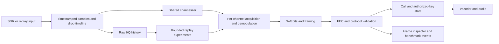

# Measured XeraX SDR engineering program

Baseline: Windows preview 3 at ab79212. Research references: [platform comparison](PLATFORM-COMPARISON-2026.md), [privacy/conformance scope](PRIVACY-AND-CONFORMANCE.md). This is a sequence of independently reviewable milestones. Completion of the benchmark foundation does not complete the receiver roadmap.

## Measurement contract

Progress on 25 September 2026: [overnight research ledger](OVERNIGHT-RESEARCH-2026-09-25.md).
The 4.3.2-rc.1 candidate corrects independently verified NXDN weighted-cost and
block-reset defects. Standalone bounded IQ-history/credit prototypes and a tested
sample-event contract advance M4/M1 foundations; live integration and latency
gates remain open. These results do not complete M1, M2 or M4.
The subsequent [25-trial paced history screen](IQ-HISTORY-LATENCY-2026-09-25.md)
rejected both try-lock chunk sizes: they lost useful snapshot work and increased
producer p99. A bounded immutable-ownership alternative is now specified for
independent testing. Stream-wide timeline closure and benchmark failure
validation were strengthened; the failed storage candidate remains experimental.
The [next correctness increment](IQ-OWNERSHIP-CONTRACT-2026-09-25.md) now passes
15 independent synchronous ownership groups within a 15 MiB source-payload
budget. The hardened observer's 21 tests preserve failure and lifetime evidence;
all current schema-2 observations remain performance-ineligible until actual
publication/selection is observed. Both Android ABIs cross-compile but have not
executed on devices. A [bounded request coordinator](IQ-COORDINATOR-CONTRACT-2026-09-25.md)
now passes 15 independent cancellation, deadline and shutdown groups plus
Windows/Linux and race/memory-safety CI. The
[shared retirement budget](IQ-RETIREMENT-BUDGET-2026-09-25.md) extends this to 22
groups covering aggregate admission across restarts; Windows/Linux and sanitizer
checks pass with allocation-probe omissions explicit under TSan. Comparative
performance and live decoder integration remain open.
The [schema-3 observer](IQ-PUBLICATION-MEASUREMENT-2026-09-25.md) now measures
publication/selection by identity and operation brackets, and charges generation,
append, owner service and reclaim together. Independent failure controls cover
ordering, deadline contradictions and retained-request cleanup. Thirty-one short
current/frozen-source evidence runs are correctness checks, not a speed screen.
The [fully warmed schema-4 screen](IQ-WARMED-SCREEN-2026-09-25.md) now completes
CPU/bounded-memory measurement and conservative per-request grant bounds. Its
nine preregistered runs reject this candidate as a latency improvement: producer
p99 is 15.4% higher and median process CPU 11.9% higher despite 900/900 verified
eligible completions for both designs. Keep it separate from app defaults.
Next: a bounded readiness-notification experiment against the frozen polling
coordinator, with CPU, producer latency, completion and no-lost-wakeup gates.
Source-driver integration, real decoded traffic and phone execution remain open.
The [notification primitive and actual-mailbox composition](IQ-NOTIFICATION-CONTRACT-2026-09-25.md)
now pass 16 correctness groups across Windows/Linux and sanitizers, with both
Android targets compiling. The [persistent observer and fixed six-run comparison](IQ-NOTIFY-SCREEN-2026-09-25.md)
now preserve exact request/token identity and all 900 verified completions per mode.
They fail the preset CPU gates: only 5.98% lower median CPU and one of three paired
wins. Producer p99 improves, but verification-completion p99 worsens in every pair.
Keep notification out of application defaults. Further storage changes require
causal CPU attribution and demonstrated useful-frame benefit; prioritize actual
sample-indexed acquisition/recovery measurements next.

The [complete-frame baseline](NXDN-FRAMES-2026-09-25.md) and
[first canonical NXDN48 candidate](NXDN-FIRST-SYNC-2026-09-25.md) now provide
measured M1 component progress. Across 120 positive cases, the isolated
candidate validates the opening control frame 79.9375–80.0625 ms earlier and
preserves all later verified frames. The 36 negative/history controls gain no
false current proof. Windows and four Linux release/sanitizer pairs agree.
Extra invalid-frame work is measured and retained. Next gates are held-out
payloads/seeds, mid-frame entry, sync damage, slips, impaired IQ and full-engine
scanner/profile regression; this result does not complete M1 or change app
defaults. In particular, scanner timing updates before CRC proof need an
explicit integration test. No CPU, voice-latency or physical-RF gain is claimed.

Preserve original capture hashes, provenance, sample rate/format, device metadata, transformations/seeds, exact command arguments, binary identity, source revision, host and operating-system details. Store raw logs and machine-readable metrics. Missing measurements are null/pending, not zero. Known-field assertions, decoded frame counts and real BER are different evidence.

Separate real-time sample-domain acquisition latency from process wall time. A fast replay duration includes startup/shutdown and is not time-to-first-audio. Separate instrumentation runs from speed runs. Repeat timing with rotated variant order; report median, p95 and paired differences. Use uncertainty intervals when enough independent repetitions exist. Never run competing speed trials concurrently.

For throughput/load, deliberately run concurrent receivers as a separate workload and label it process-load testing, not shared-channelizer performance. Different SDR hardware requires real captures or live acceptance runs; a metadata label cannot simulate tuner overload or driver behavior.

## Milestones and gates

| Milestone | Deliverable | Release gate |
| --- | --- | --- |
| M0: evidence foundation | Corpus registry, deterministic impairments, native/reference adapters, frame inspection, repeatable reports, CI and pending-coverage ledger | Hash/format validation; tests for false positives, missing tools, timeout and score integrity; initial real baseline runs |
| M1: acquisition instrumentation | Sample-indexed detect/sync/first-valid-frame/first-PCM events; lost-lock and recovery markers, confidence provenance | Known synthetic timeline verifies every latency and no instrumentation-driven behavior change |
| M2: confidence and FEC | Preserve independent bit reliability through NXDN/DMR paths; calibrate metrics and compare soft/hard decisions | Bit-exact clean cases and a held-out marginal-signal improvement with no new false-valid control events |
| M3: persistent workers | Cross-platform receiver abstraction, Windows workers, independent per-call state, shared float channelization and priority scheduling | Overlapping calls, high grant rates, slot isolation, 60-minute bounded-queue run and no control-channel starvation |
| M4: raw-signal history | Bounded pre-demodulation ring, retrospective acquisition, SigMF export and retune/drop timeline | Captured beginnings recovered correctly; uncaptured frequencies never claimed recovered; memory/time budgets enforced |
| M5: adaptive DSP | Bounded timing/filter/equalizer candidates, per-site settings, rollback and protocol-aware acquisition scheduling | Paired impairment curves, interference/simulcast holdout, lower missed-call/frame-loss rate within declared latency budget |
| M6: privacy conformance | Authorized-key signaling-to-audio paths and storage hardening | Exact reference output, wrong/missing material negatives, vendor matrix and no stale key/IV across calls |
| M7: acceleration | Profile-driven CPU/SIMD, optional GPU batch processing, workload-based backend selection | Same decoded bits/acceptable numeric tolerance, measured end-to-end advantage, CPU fallback and driver matrix |
| M8: local RF learning | Occupancy/classification model with unknown output; later learned equalizer/bit-confidence experiments | Radio/site/session holdout, calibration, simple-DSP comparison, reproducible model/data provenance |
| M9: hardware diversity | Two-receiver selection, then optional coherent-array research | Aligned identity/frames, improved held-out results and no combining of different payloads |
| M10: community quality | Versioned plugin/API contracts, packet/frame inspector, documented benchmark releases | Stable schemas, compatibility tests, reproducible artifacts and factual release claims |

M1 component progress: the [NXDN48 discriminator observer](NXDN-ACQUISITION-2026-09-25.md)
now passes its 120-case known-dibit contract and 40 buffer-invariance groups on
Windows. It measures actual cache deliveries and leaves the real symbol/sync
results unchanged. This is not completion of M1: original-IQ lineage, valid-frame
events, matched-filter handbacks, recovery and PCM timing remain open. Its first
accepted FSW is the second generated one in every case, establishing a bounded
future hypothesis for independently validated first-FSW acquisition rather than
removing the existing confirmation guard without false-positive evidence.

## Protocol work packages

- DMR Tier II: base/mobile/direct bursts, timing, both slots, embedded link control and privacy indicators. Tier III: control/grant/channel-plan transitions. Capacity Plus: rest-channel changes, LSN maps and busy-site behavior. Connect Plus: dedicated signaling/voice allocation and LCN maps. Capacity Max/XPT/other variants get separate capability rows, never inherited “all DMR” certification.
- NXDN: rate-specific acquisition, convolutional/FEC confidence, conventional calls, Type-C control and Type-D distributed signaling, channel mapping and late entry. Type-C and Type-D are different scheduling models, as documented by the NXDN Forum.
- P25: C4FM and CQPSK/LSM; Phase 1 control/voice, Phase 2 alignment/network context, grants, ESS and recovery. Measure simulcast separately from additive noise.
- Classification: staged energy/occupancy → modulation/rate candidates → sync hypotheses → verified protocol messages. Cache productive candidates without starving unknown signals. No signal is confirmed by a neural score or sync hit alone.

## Proposed architecture

The live chain owns real-time deadlines. Experiments consume a bounded spare budget and cannot block control-channel decoding or audio. A wider input device or extra receiver is required for simultaneous frequencies outside a single captured passband.

## Experimental acceptance

Keep an untouched baseline binary. Introduce one hypothesis at a time. Use development captures for tuning and a distinct held-out set for the decision. Example target: at least 20% fewer erased frames on a declared marginal-signal subset, without worse false acceptance on the fixed negative set. This is a proposed gate, not a measured result or a universal requirement.

If an equalizer, learned model or GPU path loses, retain the experiment/result for diagnosis and leave the baseline active. Neither sound quality adjectives nor feature counts substitute for the recorded results.

## Recovery decision after the boundary screen (2026-09-25)

The [144-invocation boundary experiment](NXDN-BOUNDARY-V1-2026-09-25.md)
passes measurement and fails content retention. Its sync veto helps two damaged
cases but discards a correctly decodable off-phase frame. Keep it isolated from
app targets. This rules out promoting that fixed veto; it does not rule out all
phase tracking, and it is not grounds to widen its window after the result.

The next bounded steps are independent clear voice/control-transition vectors,
then a separately registered history or parallel-hypothesis experiment that
preserves off-phase candidates. Carry the relaxed-gap counterexample into every
new retention gate. Require explicit work/memory budgets, stream-generation and
receiver ownership, observer neutrality, unchanged clean/negative controls, and
exact source voice/control content. The existing malformed-header PCM episode
still requires separate routing analysis; silence or nonzero samples alone are
not evidence of correct voice. Complex-IQ impairments and device acceptance must
precede any product promotion or claimed RF/speed advantage.

## Independent voice-word foundation completed (2026-09-25)

The [registered channel-word study](NXDN-VOICE-WORDS-V1-2026-09-25.md) passes:
8,266 independently encoded words agree byte-for-byte with pinned MMDVM-Host,
and 27,044 calls through the actual hard/soft FEC functions meet exact source-bit
expectations. This completes the **word-level** fixture gate only. The 3,650
unprotected-bit cases deliberately retain their source-bit error; success flags
are insufficient evidence of original content. No timing or audio-quality
advantage has been measured.

Next, separately register full clear-call/control-transition fixtures and track
those known source words through the real receiver's routing. The primary frame
builder requires a documented minimal tail-puncture bounds guard and explicitly
initialized control fields, plus independently corroborated whole-frame bytes.
Only then test a bounded history or parallel-hypothesis candidate against the
retained off-phase control, malformed-header case, clean voice and negative
controls. Keep source truth independent of decoder output. Device/complex-IQ
acceptance remains a later mandatory product gate; RC3 and its defaults stay
unchanged.

## Complete-frame construction reference completed (2026-09-25)

The [registered nine-frame reference](NXDN-AIR-V1-2026-09-25.md) now agrees on
all 864 raw/air bytes with separately compiled primary encoders. Its 24 known
voice-word intervals, header/trailer and both FACCH half-steal layouts have independently
checked identities. The five minimal primary-encoder copy corrections were
registered before execution and do not modify any product decoder.

The next gate is actual receiver routing, not another native reference rerun.
Record original frame/slot identity and exact source bits at the real FEC return
and synthesis-input boundaries; require observer neutrality and finite-input
accounting, clean retention and negative controls. A counter or nonzero PCM
cannot establish accepted speech. The second SACCH cycle in this finite reference
is partial and must not be credited as a completed message. Only a separately
registered downstream gate can establish call behavior. RC3 packages and defaults
remain unchanged; the previous recovery veto remains rejected.

## Clear routing outcome and next exposure gate (2026-09-25)

The [36-invocation routing study](NXDN-CLEAR-ROUTING-V1-2026-09-25.md) passes
measurement but fails progression. The fixed default-mode primer cannot establish
the assumed clear call, and its bad-LICH source is not exposed. The public fast
option routes 24 known occurrences versus 8 on the same cold input and reaches
first FEC 320 ms earlier in source-stream time. This is a bounded acquisition
result for an existing option, not a new whole-app or RF performance claim.

Before implementing a history, parallel-hypothesis or EOF guard, separately register
an acquisition-conditioned control set that actually reaches the intended parity
and partial voice slots. The existing prefix results contain no voice calls and
cannot certify active-voice EOF behavior. Preserve exact per-slot source ownership,
call state and known bits at both FEC and synthesis boundaries. Keep the failed
primer and earlier off-phase and malformed-header counterexamples as required controls.

Correct the documented substitution-flag test constants only in a separately frozen
follow-up checker, using the actual installed header (32/64/128), and distinguish
bit retention from ERASURE/REPEAT/MUTE and speaker output. The completed study's
original checker and outcomes stay immutable. RC3 packages/defaults remain unchanged;
independent impaired I/Q and physical/application acceptance are still required.

## Active exposure measured; next change is explicit input availability (2026-09-25)

The [16-process active-boundary study](NXDN-ACTIVE-BOUNDARIES-V1-2026-09-25.md)
reaches all intended source intervals and exposes a concrete input-lifetime bug:
40 real synthesis calls consume incompletely delivered slots. The complete early
word still survives later EOF. Separately, an actual parity rejection is safe for
its target but loses eight of twenty subsequent clean words. Both failures remain
published; no new APK/EXE or default is promoted from this observation study.

Implement the [explicit-availability design](NXDN-INPUT-AVAILABILITY-DESIGN-2026-09-25.md)
as a separately registered isolated candidate: additive checked symbol/dibit APIs,
frame-local availability and per-slot voice guards, with complete-range control
checks. Keep legacy APIs, replay/datascope behavior and logical slot numbering.
Guard before FEC, media marking or copying audio; a frame-wide EOF abort would
throw away a fully received early slot. Do not mix synchronization-policy changes
into this bounded fix.

Freeze new candidate identities against the existing cached 16-boundary and four
clean-anchor traces. Require no unavailable FEC/synthesis, exact early-word and
24-word clean retention, unchanged callback/chunk results, replay-mode tests and
source/linkage proof. Retain the bad-LICH recovery failure as a separate unmet gate.
Prior off-phase and malformed-header counterexamples must pass their bounded
preservation checks before broader integration. Phone/receiver, human listening and
independently impaired complex-IQ acceptance remain pending.

## Availability guard passes its first receiver gate (2026-09-25)

The [isolated implementation](NXDN-AVAILABILITY-V1-2026-09-25.md) now stops all
40 unavailable-slot synthesis calls in the registered prefix controls, retains
the complete early words and preserves 24-word clean calls. All 20 new identities
exit zero; source bits, callback/chunk neutrality and preservation pass. The
independent bad-LICH 12/20 retention failure remains unchanged. Product promotion
is still false; this result is not yet part of the APK or Windows installer.

Next, register a bounded candidate-only comparison against cached prior
off-phase and malformed-header controls. Require unchanged valid frame/word
retention and no added wrong-route audio; retain any pre-existing malformed-header
PCM failure explicitly rather than relabeling it. Do not rerun old binaries or
combine the availability change with a new sync policy. Expand the checked-input
contracts for Pulse/headful WAV separately. Once relevant software integration
gates pass, apply the reviewed delta to shared product sources, run normal
Android/Windows regression/package checks and produce actual integration builds.
Physical RF/phone and human audio acceptance remain explicit follow-up tests.
