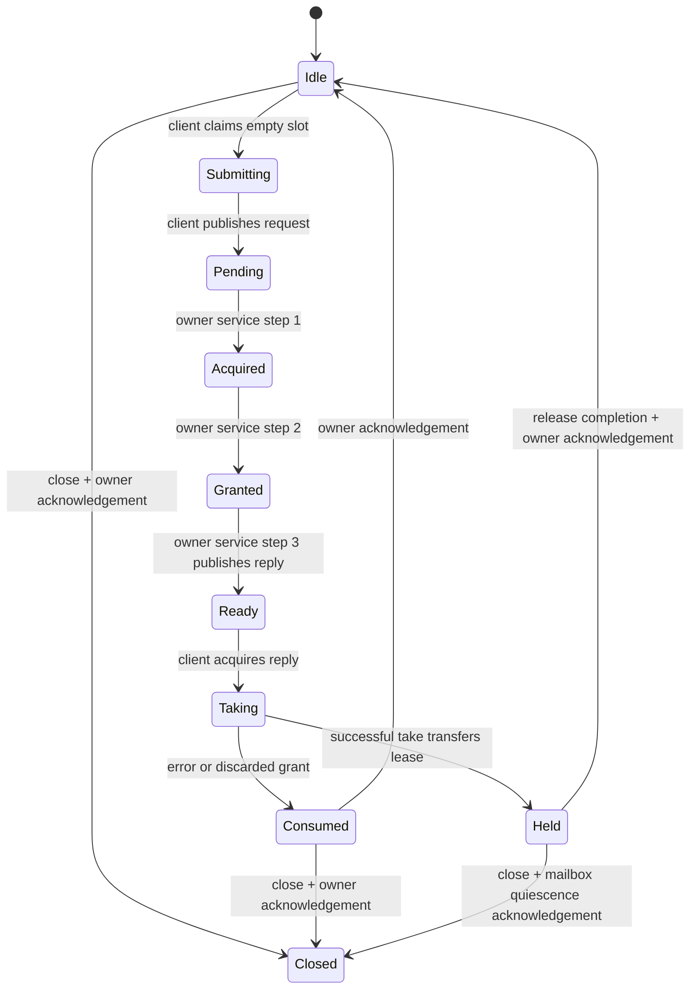

# Single-request IQ coordinator: correctness experiment

This standalone C++17 prototype wraps the existing [immutable slab history](../iq_slabs/README.md) with one request/reply mailbox. It is **not connected to the live receiver**, does not spawn a worker or read a clock, and has no timing, throughput, RF, decoding, or decryption result. Its hypothesis is that explicit publication, ownership and acknowledgement can preserve exact captured sample intervals during cancellation and shutdown without making the source owner wait for a reader to release its payload.

The scope is one history owner and one client/coordinator role. The owner may perform ordinary history append/retune operations between mailbox service steps. A taken result may be transferred to another consumer with caller-provided synchronization; that consumer may release it. Cancellation and submission belong only to the single client role, not arbitrary third threads. Live delivery queues, multiple requesters, queue scheduling, a source driver and retrospective/live deduplication are not implemented. A required shared coordinator budget now bounds reservation charges across mailbox construction, destruction and retained weak-ticket domains; its scope is the mailboxes explicitly using that same ledger.

## Protocol



`Submitting` and `Taking` are private, bounded operations within one client call. The three separate owner phases provide deterministic test pauses without production callbacks. **All admitted requests, including cancellations and errors, traverse the three owner phases.** A successful `service()` phase returns `Step.status == Ok`; the eventual request result is delivered in `Reply`, not encoded as an early service return. Idle service returns `Empty`, an occupied Ready/held slot returns `Busy`, and terminal service returns `Closed`.

One credit covers pending request, prepared grant, ready response, taken/held result, release publication and owner acknowledgement. A reset result does not make the slot immediately reusable: the owner must acquire its completion flag, reclaim the core pin and publish `Idle`. An error response also requires client consumption followed by owner acknowledgement. A stale ticket cannot consume or cancel a new request. No completion queue exists that could overflow and drop a release; the single admitted ownership has its own preallocated atomic completion flag.

The owner never overwrites a Ready reply. Closing with a pending request drives it to an explicit reply, which the client must take. If the client stops consuming, the bounded mailbox can remain occupied indefinitely; cancellation or deadline expiry is not permission to reclaim pointers or skip acknowledgement.

## Cancellation, ticks and outcome precedence

The deterministic outcome precedence at owner checks and at client take is:

1. `Closed` if a sticky close request is observed.
2. `Cancelled` if the current request was cancelled.
3. `DeadlineExpired` if the supplied check tick is at or beyond the deadline.
4. The source result: success, or `SourceError` with the exact `slabs::Status`.

The owner checks at acquisition, before source grant, and before reply publication. The client checks again when taking an already Ready reply. Thus cancel/close/expiry after grant but before take discards the queued grant safely and returns an error with zero spans. Cancel after take returns `TooLate`; it cannot revoke a consumer's lease. An old ticket from another sequence or ownership domain returns `NotCurrent` and changes no flags.

Ticks are explicit unsigned 64-bit values supplied by the caller in one monotonic domain. Equality with the deadline is expired. There is no tick addition/subtraction, so `UINT64_MAX` comparisons do not wrap. Calls must be nondecreasing within each role. Acquisition additionally requires its tick to be at least the request's submission-check tick; take requires a tick at least the reply's publication-check tick. A regressing tick rejects that operation without advancing its phase. A caller retry may supply a later valid tick.

`submitted_check_tick`, `grant_check_tick`, `publish_check_tick` and `take_check_tick` record **caller-supplied check values**, not measured event times. Preemption after a check is unobserved. This prototype does not prove a hard deadline, actual publication/selection timing, request-to-grant latency or benchmark eligibility. A future timed coordinator must capture and distinguish real event intervals rather than relabel these supplied values.

## Ownership and happens-before edges

The ordinary request/reply fields and move-only source lease are not atomics. They are protected by role ownership and the following explicit edges:

| Publication | Observation | Protected ordinary storage |
| --- | --- | --- |
| Client stores `Pending` with release after writing request | Owner acquires `Pending` | Exact request, ticket, deadline and submission tick |
| Owner stores `Ready` with release after writing full reply/grant | Client acquires `Ready` | Reply provenance and movable source lease |
| Client stores `Consumed` with release after discarding/moving response | Owner acquires `Consumed` | Completion of client access to reply slot |
| Taken result resets its core lease, then stores completion with release | Owner acquires completion while Held | End of consumer payload access and source ownership release |
| Owner publishes `Idle` with release after reclaiming/resetting the slot | Client claims Idle with acquire | Permission to overwrite the previous slot generation |
| Client publishes `Held` with release after moving the source lease out | Owner acquires Held before acknowledging closed mailbox | No source lease/descriptor remains in the response slot |

The owner does not touch ordinary reply fields while Ready/Taking. Cancellation and close flags are separate atomics and do not themselves authorize payload access. The underlying slab completion protocol still controls physical pin reclamation. Shared/weak ownership and atomic operations are **not claimed to be lock-free or wait-free**; a fixed operation count does not bound scheduler delay or final deallocation.

A retune after source grant leaves an already pinned grant wholly in its original epoch. Ready/taken replies preserve the exact original `slabs::Request` and `LeaseInfo`; they never relabel old bytes with the new current stream. Retune before grant can instead produce an explicit source error. Failed replies retain original request provenance while exposing no usable spans.

## Shutdown and lifetime

`close()` rejects new submissions but does not drop a response. Terminal `Closed` is acknowledged only after the request/reply slot is drained: directly from Idle, after consuming an error, or from Held after the successful result has left the mailbox. **Shutdown acknowledgement means mailbox quiescence, not that all consumer payload has been reclaimed.**

A taken `Reply` owns its immutable core lease and a shared preallocated completion/control token. It may survive close, owner acknowledgement, stopped/joined role threads, destruction of `Mailbox`, and destruction of the `History` facade. Its eventual reset touches surviving control state and the core lease, never a destroyed mailbox or history reference. There is no forced timeout reuse. Final reset may deallocate retired storage or touch the core budget ledger; it is a safe lifetime path, not a real-time release guarantee.

The caller must retain Mailbox and History until the client and owner roles have stopped/joined and the owner has acknowledged shutdown. The library supplies no worker stop/join mechanism. Destruction belongs on a control path. Continued concurrent calls after facade destruction violate this explicit lifetime contract.

## Ticket ABA and memory accounting

Tickets are opaque values containing a sequence and weak ownership-domain identity. Equality and validation compare shared-control ownership with `owner_before`, not raw pointer addresses. A newly constructed mailbox is a different domain even when its sequence restarts at one or an allocator reuses an address. Sequence limits are checked before increment; `Config.max_ticket` permits small deterministic exhaustion tests. Tickets are not serializable numeric handles.

The constructor now requires `Mailbox(history, budget, config)` with an explicitly constructed `Budget(reservation_limit)`. This is an API change from the earlier per-instance-only prototype: there is no default private ledger. Pass the **same Budget** to every concurrent mailbox and restart that must share an aggregate reservation cap. Separate explicitly constructed budgets are separate domains; creating several budgets does not establish an implicit global cap.

`Budget::stats()` reports these synchronized categories:

| Category | Charge lifetime |
| --- | --- |
| `ledger_allocation_bytes` | Actual rebound `allocate_shared` allocator request for the ledger, checked against the cap before allocation; survives through the final allocator-held ledger token |
| `control_allocation_bytes` | Actual rebound allocator requests for mailbox control blocks, including constructing, live and weak-retired blocks |
| `fixed_reservation_bytes` | `sizeof(Mailbox) + sizeof(one Reply)` per admitted control allocation; reserved even if these caller objects are on the stack |
| `current_reserved_bytes` | Sum of the above; never greater than the configured `reservation_limit` |
| `high_water_reserved_bytes` | Maximum admitted reservation, including an allocation attempt that subsequently fails |
| `control_reservations` / `high_water_control_reservations` | Current and maximum admitted control reservations, including in-flight constructors and retained weak domains |

Before allocating a mailbox control block, the allocator reserves its **actual rebound allocation size plus both fixed categories** while holding the shared ledger mutex. Competing constructors cannot admit the same remaining capacity. The mutex is released before calling the allocation operator. If allocation fails, the current reservation is refunded and the original exception propagates; its high-water reservation remains as evidence of the attempted admission. Failure to fit the aggregate limit throws the fixed-message `budget_exhausted` exception. Invalid per-mailbox profiles are rejected separately. Exception-runtime storage is outside the declared allocator-request ledger and occurs only on these control paths.

`metadata()` still reports the actual control allocator request plus `sizeof(Mailbox)` and one operational `sizeof(Reply)`. These must fit a **separate 8 KiB per-mailbox cap** (or a smaller configured cap). The implementation measures the rebound allocator request, not `sizeof(Control)`. This prototype explicitly supports exactly one nonzero allocation request per `allocate_shared` construction and rejects a zero or second request; it does not assume that the standard's recommendation to use at most one allocation is an unconditional guarantee. The ledger's own allocation is measured by the same approach and charged before any mailbox is admitted.

Retained weak tickets preserve the **entire control allocation and fixed reservation** after its facade and Control object have been destroyed. An allocator-held shared ledger token keeps accounting state alive independently of `Budget`, `Mailbox`, `Control` and stack construction observers. During final weak deallocation the allocator first saves that token and the immutable charge sizes, frees the control allocation, and **only then** refunds its reservation. No ledger mutex is held during the physical free. Admission cannot reuse its charge while deallocation is still pending. Final ledger deallocation accesses no destroyed facade or construction observer.

Normal submit/service/cancel/take/reclaim operations do not allocate or take the budget mutex. A normal reset may become a final control/ledger deallocation when facades have already been destroyed; this is an explicitly excluded control-path lifetime cost, not a real-time release guarantee. Construction, statistics, admission and final refund may lock the ledger mutex. No IQ payload is copied or newly allocated by the coordinator; a grant holds the core's existing bounded snapshot pin.

**These are reservation bounds, not process RSS or a hidden global cap.** The original slab metadata profile remains separately bounded up to 128 KiB. A shared coordinator ledger adds its explicitly configured reservation cap; it is not silently included in the slab profile. The `Budget` facade and arbitrarily retained error Reply, Submission and Ticket value objects are caller-owned storage outside the single operational-handle reservation. Their associated retained control allocations remain fully charged, but the arbitrary value objects themselves are not counted. Caller buffers, thread stacks, allocator headers/pages and whole-process RSS also require separate accounting. High-water is reserved bytes, not committed or resident operating-system memory. This correctness-only admission change establishes no timing-promotion or receiver-performance result.

## Build and independent verification

```text
cmake -S experiments/iq_coordinator -B build/iq-coordinator-agent -G Ninja -DCMAKE_BUILD_TYPE=Release
cmake --build build/iq-coordinator-agent
ctest --test-dir build/iq-coordinator-agent --output-on-failure
```

This target compiles the existing slab source without modifying it or linking to the live application. GNU/Clang use strict warnings as errors; MSVC uses `/W4 /WX`. Independent C++ tests exercise exact bytes and handshake interleavings. The separately maintained `model_contract.py`/`test_model_contract.py` explore abstract public handoff states and deliberate broken transitions; that abstract model is not a proof of this implementation or the C++ memory model. Record real test results and platform limitations before making a correctness claim. No performance workload or receiver benchmark is included here.

For the required-shared-budget revision, the local Windows GNU 16.1 C++17 build with warnings as errors passed all **22 groups, 5,434 assertions and 14,801,814 exact oracle bytes**. CTest passed the same contract executable. The original 15 handoff groups retained all 5,063 assertions and 14,777,814 oracle bytes. The seven added groups independently observe allocator requests and test exact-cap admission, retained weak domains across restarts, simultaneous constructors sharing a cap, held results alongside retired domains, facade-first destruction, a paused physical-delete boundary and injected construction allocation failures.

On this tested x64 ABI, the measured ledger allocator request was **104 bytes**, each control request **392 bytes**, and the fixed reservation **336 bytes** (`Mailbox` 56 + `Reply` 280). Thus one mailbox reserves 728 bytes, and its shared ledger with exactly one admitted domain reserves **832 bytes**. These are measured ABI-specific reservation units, not portable constants or process-memory measurements. Parent-managed cross-platform and sanitizer checks must be evaluated separately for this revision; an earlier prototype's passes are not evidence for the new allocation path.

The separate ThreadSanitizer build uses the sanitizer's allocation operators;
the test's replacement C++ allocation counter is unavailable there. All
ownership/byte operations still run, and the executable reports omitted
allocation assertions explicitly. Ordinary and address/undefined sanitizer
builds retain that counter. CI first requires a deliberately racy standalone
probe to produce an actual TSan data-race diagnostic; runtime startup failure
or arbitrary nonzero exit cannot count as a successful instrumentation control.
